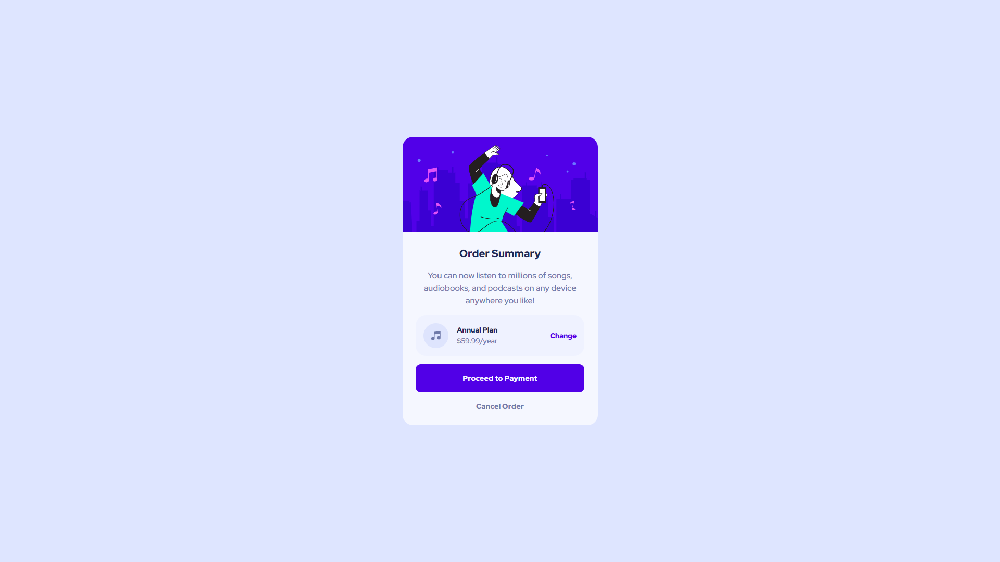

# Frontend Mentor - QR code component solution

This is a solution to the [QR code component challenge on Frontend Mentor](https://www.frontendmentor.io/challenges/qr-code-component-iux_sIO_H). Frontend Mentor challenges help you improve your coding skills by building realistic projects.

## Table of contents

- [Overview](#overview)
  - [Screenshot](#screenshot)
  - [Links](#links)
- [My process](#my-process)
  - [Built with](#built-with)
  - [What I learned](#what-i-learned)
  - [Useful resources](#useful-resources)
- [Author](#author)
- [Acknowledgments](#acknowledgments)

## Overview

### Screenshot

### Links

- Solution URL: [Website]((https://www.frontendmentor.io/solutions/order-summary-component-responsive-with-flexbox-GpX_V7-N__))
- Live Site URL: [Website](https://lost50u1.github.io/order-summary-component-main/)

## My process

### Built with

- Semantic HTML5 markup
- CSS custom properties
- Mobile-first workflow
- CSS flexbox

### What I learned

I learned more about websites layout.

I used a combination of flexbox and cssgrid and more layout of items.

and i used rem and em instead of pixels in this challenge

### Useful resources

- [Card component on freecode camp](https://www.freecodecamp.org/news/learn-css-basics-by-building-a-card-component/) - This helped me cause it got similar layout to some level.

## Author

- Website - [Biruk Moges](https://lost50u1.github.io/qrcodecomponent/)
- Frontend Mentor - [@lost50U1](https://www.frontendmentor.io/profile/lost50U1)
- Twitter - [@cc64e15cb0f543a](https://www.twitter.com/@cc64e15cb0f543a)

## Acknowledgments

I used https://www.freecodecamp.org website as a guide to do the project and it have many useful tutorials i used for this project.
